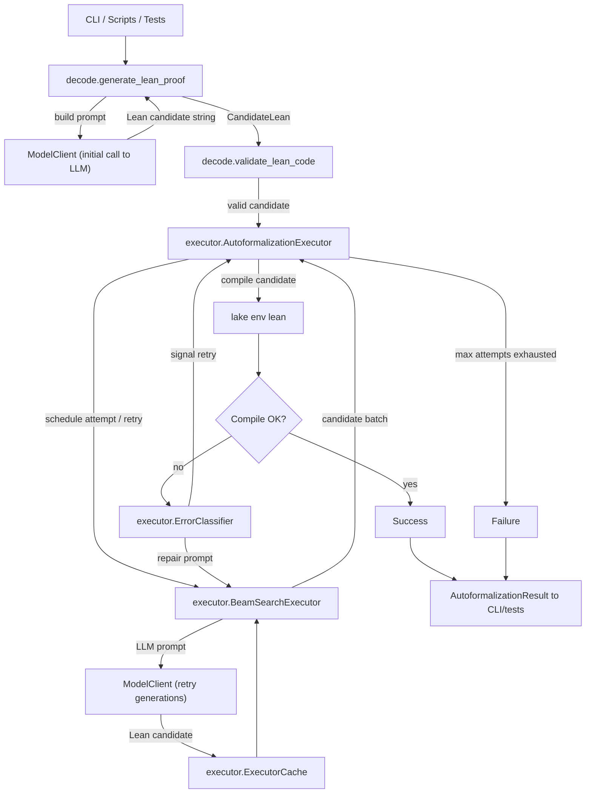
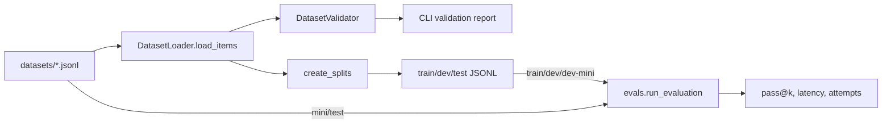

# Autoformalizer Architecture

This document outlines the architecture and key components of the autoformalizer project, which translates English proof sketches into Lean 4 proofs using a LLM, and validates the proofs with the Lean toolchain.

## System Overview

The autoformalizer ingests English proof sketches, prompts an LLM to propose Lean theorems, and validates the results against the Lean toolchain. Python orchestrates LLM calls, retry logic, caching, dataset management, and evaluation, while Lean 4 remains the ground-truth verifier. The repository is organized as a Python package (`autoformalizer`) with CLI tooling layered on top and a Lean project (`Autoformalizer`) that exposes shared imports for generated proofs.

### Major modules

- `autoformalizer.decode`: Prompt construction, LLM client abstraction, candidate extraction, and light-weight structural validation.
- `autoformalizer.executor`: Error-classified retry loop that iteratively generates, compiles, and repairs Lean candidates with caching.
- `autoformalizer.datasets`: Pydantic schemas, JSONL IO, validation, and train/dev/test split creation.
- `autoformalizer.evals`: Batch evaluation harness, pass@k reporting, and rich per-item logs.
- `autoformalizer.cli`: Typer-based entrypoints that expose decode demos, dataset utilities, and evaluation commands.
- `Autoformalizer.Basic` (Lean): Minimal mathlib-backed module used as the default import for compiled candidates.

## Runtime data flow

Key behaviours:

- Each attempt uses configurable beam and temperature schedules; the first attempt uses the vanilla English prompt, while subsequent attempts inject repair prompts derived from categorized compiler errors.
- Compilation requests run inside the project Lake environment. Results are cached by Lean source hash to avoid redundant compilations.
- Generation cache keys on prompt and sampling parameters so repeated repairs with identical context reuse LLM output.
- All attempts produce `CandidateRecord` objects, enabling fine-grained evaluation metrics and audit trails.
- Compilation outcomes branch through a decision point: a successful compile returns immediately, while failures are classified and fed back into retry prompting until attempts are exhausted.
- `AutoformalizationExecutor` schedules a beam attempt both for the initial try and whenever the error classifier signals a retry, so the loop only calls back into `BeamSearchExecutor` when another batch of candidates is required.

## Executor loop

`AutoformalizationExecutor` is the integration point for generation, compilation, caching, and error handling. It consumes dataset items (Python dicts matching `ProofItem`), delegates to `RetryPolicyExecutor`, and assembles an `AutoformalizationResult`:

- `RetryPolicyExecutor` drives attempts until success or exhaustion, compiling valid candidates via a callback that applies compile caching.
- `BeamSearchExecutor` constructs prompts for each beam slot. Initial attempts call into the decode prompt template; repair attempts call `generate_repair_prompt` with the primary classified error.
- `ExecutorCache` exposes LRU caches for generation, compilation, and optional validation, exposing hit/miss stats for telemetry.
- `ErrorClassifier` parses Lean stderr into structured `LeanError` categories (unknown identifier, type mismatch, tactic failure, missing premise, syntax) to inform subsequent prompts.
- Bounding controls (max attempts, timeout in the Lean compiler helper, LRU sizes) protect against runaway retries.

`AutoformalizationResult` contains attempt logs, compilation outcomes, and cache metadata consumed by CLI commands, tests, and evaluation reports.

## Beam search executors and Retries

Beam search is a parallel sampling strategy: instead of trusting a single generation, it spins up several “beam slots,” each representing one independent candidate drawn from the model with slightly different randomness. The executor fills those slots using the configured schedules.

- `BeamSearchExecutor` constructs prompts for each beam slot. Initial attempts call into the decode prompt template; repair attempts call `generate_repair_prompt` with the primary classified error.

    - The beam system samples multiple candidates per attempt according to the `RetryConfig` schedules. `beam_schedule[n]` controls how many generations are requested on attempt *n*, while the paired `temperature_schedule[n]` widens or narrows the sampling distribution to trade determinism for diversity. Each slot uses a distinct seed so the LLM explores different proofs even with identical prompts. Collecting a batch of diverse candidates before compiling raises the odds that at least one proof both passes structural validation and compiles, letting the executor terminate early on success.
- `ExecutorCache` exposes LRU caches for generation, compilation, and optional validation, exposing hit/miss stats for telemetry.
- `RetryPolicyExecutor` drives attempts until success or exhaustion, compiling valid candidates via a callback that applies compile caching.

## Dataset lifecycle

Proof data lives in JSONL files under `datasets/`. Each row conforms to the `ProofItem` schema with structured English, Lean code, topic, and identifiers.

- Loading: `DatasetLoader.load_items` validates and materializes `ProofItem` objects. Failed parses include line numbers for quick triage.
- Validation: `DatasetValidator.validate_dataset` checks duplicate IDs, near-duplicate Lean payloads, topic distributions, and (optionally) Lean compilation using the executor’s compiler helper.
- Splitting: `DatasetLoader.create_splits` performs deterministic, topic-aware sampling into train/dev/test ratios with per-topic balancing and reproducible seeds.

## Evaluation and experimentation

`evals.run_evaluation` wires a retry-configured executor to a dataset split:

- Accepts a model client factory so evaluations can reuse a single OpenRouter session or inject mocks in tests.
- Emits `EvaluationReport` objects containing aggregate metrics, per-item outcomes, pass@k judgments, and serialized candidate logs for downstream analysis.
- CLI command `autoformalize evaluate` wraps the harness and provides JSON export, streaming progress lines, and Typer-colored summaries.

Offline experimentation typically follows this loop:

1. Create or update datasets and run `autoformalize validate-dataset` with compilation checks enabled to ensure Lean snippets still pass.
2. Run targeted decode experiments via `autoformalize decode` or `make decode` to inspect the current model behaviour interactively.
3. Execute evaluations on train/dev/test splits with customized retry schedules to tune beam sizes, temperatures, or max tokens.
4. Inspect `EvaluationReport` artifacts or the captured `generation_log` to understand failure categories and cache effectiveness.

## Notes on Future Work

- Model integration: `ModelClient` is a narrow protocol, allowing drop-in replacements (e.g., local models, other API vendors) without touching executor code.
- Prompt customization: Repair prompts are template-based today; future work can parameterize them per error severity or include retrieved premises before regenerating candidates.
- Metrics and telemetry: `AutoformalizationResult` retains cache stats, attempt-level timings, and error categories, enabling straightforward logging or metric export without changing the execution loop.
- Premise retrieval: Hooks exist in `BeamSearchExecutor.generate_candidates` to augment prompts with retrieved lemmas; the current datasets already bundle topics that can seed retrieval algorithms.
